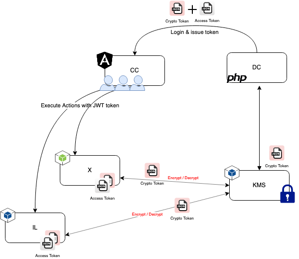
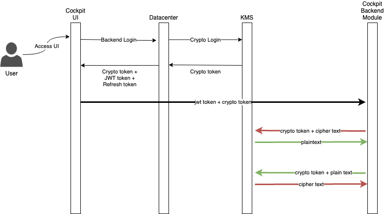

# Key Management Service

*Encryption as a service*. Allows to encrypt/decrypt small payloads. Encapsulating clients master keys inside kms module itself.
Meaning that key security is offlaoded to centralized service. CC modules can decide how they want use cryptograhy. 
Either fully via kms or partially only protecting the sensitive parts like symmetric, assymetric keys.

Current limitations:

* No support for envelope encryption with asymmetric key (rsa -> aes -> payload)
* No optimisation for big payload encryption (aes & rsa)
* No master key rotation
* Missing backwards compatibily for 3DES (deprecated symmetric) encryption

# KMS in CC Diagram

How encryption can be used in the Compliance Cockpit

# KMS Sequence

Encryption sequence for CC

